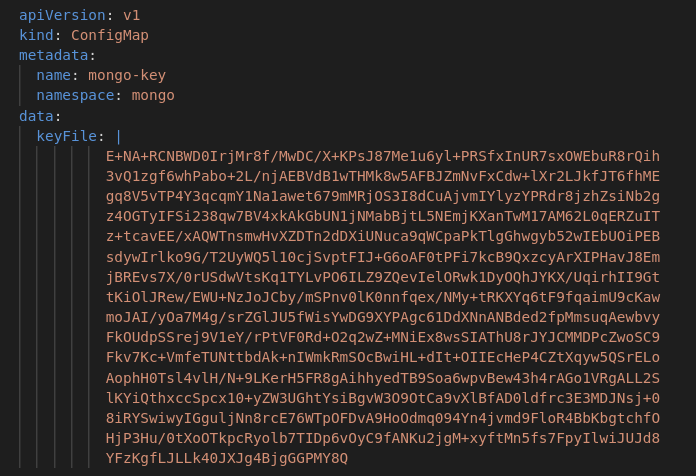
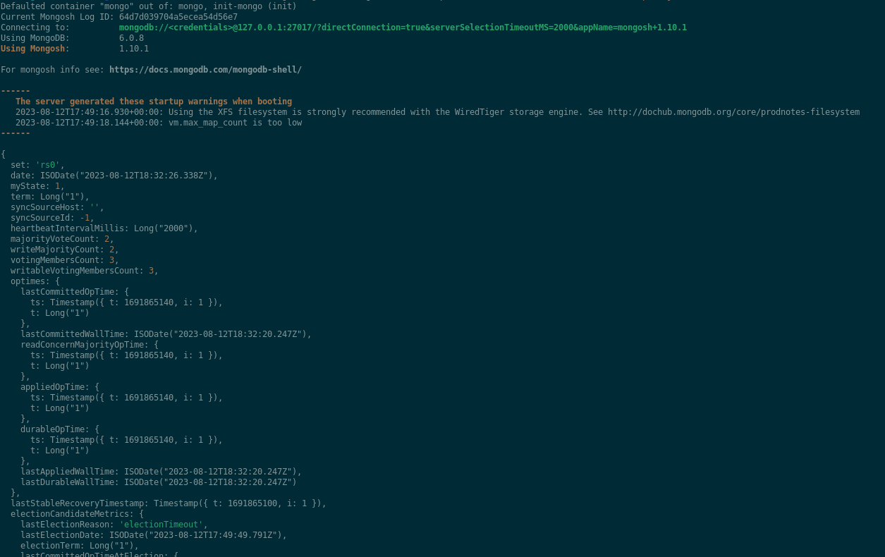
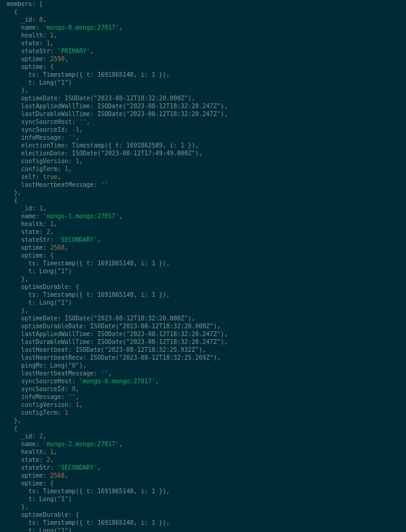
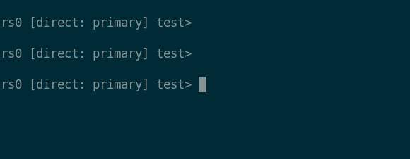
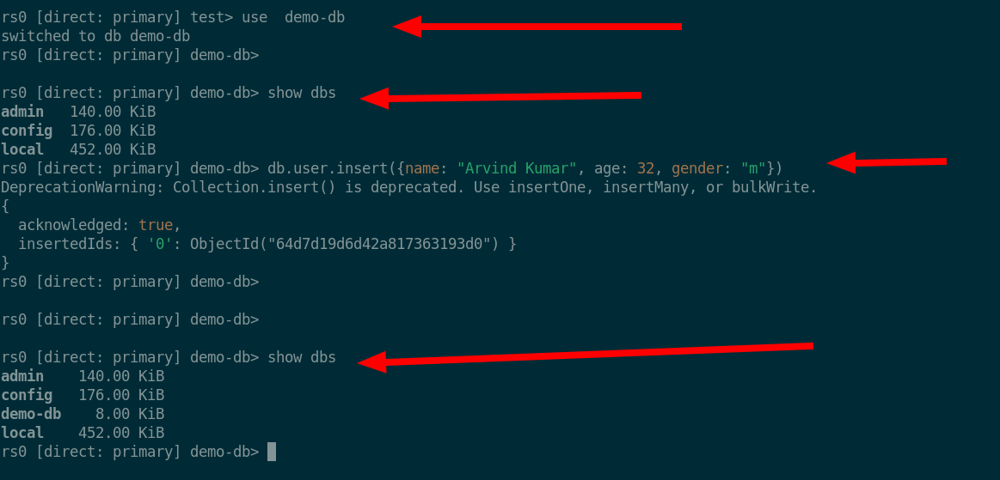
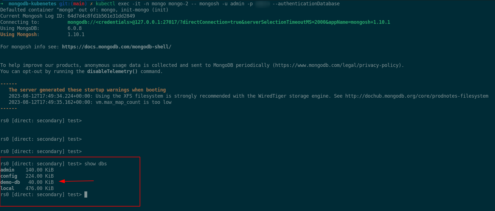

# Setup MongoDB server with Replication On Kuberentes with replicas 
## Prerequisites
    1.  Kubernetes Cluster (In My Case I am using minikube)
    2.  StorageClass to Provision PVC. ( In my Case StorageClassName is standard)
    

## Steps: 

## clone the git repository 
```bash
git clone git@github.com:ak12a/mongodb-kubenetes.git
```
## Switch to the repo directory 
 ```bash
  cd mongodb-kubenetes
 ``` 
 

## create a keyFile from your terminal

```bash
openssl rand -base64 756 > <path-to-keyfile>
chmod 400 <path-to-keyfile>

Example-Output:
    <<<4GzUIYqGEEQomrgr6sjhhJwK24kxZp+m5VJuaJooQU/a9JLm9qf4S7MBCGaMLUug
    R+n9MbIFciNxyK1YJXWhf8i8ccoLGvehbO0jCj8gJuTBRiduMaYZKqi9X70RJDcK
    Ek7kh8j1arD0O86o13pCBp64WRNE6PXqODUGsooViEta+8/BzRyUD3jcvwJIznHk
    FlgW/J04egn4ruwIesOLMTnkX8DlhYxvp/zaQkcjvlNECcsDY5Nd7eigkjb4LSI0
    pDfYC/emSpWuz/blu3IIStxr/06zGcn0kmp7Ltp9mb8ot+kgB/+IAB7qwSIt/M/d
    fhzwGlWggH2QRYlcblYATduikyypT4O+rDcww8rlO8XHt/XXfRir/2YPSDTBeMc2
    eMnUTEBQgxHgoMUZwPrk6ZWmtqs1j/Fc6NLaR2HZ9NaTRZzYwEIHxqQlnc0e4wK+
    0Z6u4UtanTBoa50R8uHo2GhgUC0rdruEuJ9nRZsnMUUt7VqlWxX0jaqHrfGYzAHB
    uBM7xxLhkrcMFY5xxm5/WkkNPDsIa5kiFmF/vbAGdiw4HpYVUTlvMKUPTiIwAiM5
    kfy4rc+3F83xhCj27uZYwy1sX66NIH/uV/hwpz87b6qnwDiZc+fRH1HG0nkD//PG
    t+ue7B3kkOfztcn0k+huBuPzXkFd9t+SAHCmctCuX7BF0YT+fJBoltjq/0DiMXUs
    aKNWXbAxtoc6+WyJn0A52WrCaA+06FgVxCQzdm5KnKgBpHNc3Ho1arw7OgjZah4b
    kT3rBG0HM3wcm8N0SaB2N3isHJySqheX6W/lcq5jVPjp/Gn8ttuQbrr5lwqwqaqn
    n6ZNy4lME9xRsIFC0DnpRsUtRcigoQFrcWHVQdlPDa72pzyeIEF271QNh1m0UtdI
    bU7NnAwDgojEp46sYRp4I0W5BR6Cl4DbjsH4XTd53YYi34MJv0rjU2Vf7KiniM7n
    kUs1ZlyFSWSqYdaeeQHvlCXgRgKwfa+UJMi1jTTc4NEho6bk
    >>>
```


## Add the above generated key in configmap
Example:


## *Create a Namespace mongo* 
```bash
kubectl create ns mongo
```

## Deploy the Mongo statefulSet
*method-1*
```bash
kubectl apply -f ./statefulset/1-mongo-cm.yaml,./statefulset/2-mongo-secret.yaml,./statefulset/3-mongo-statefulset.yaml
```
*method-2*
```bash
kubectl apply -f statefulset/. 
```


## Verify the deployment
```bash
kubectl get pods -n mongo
```
    
## Check the Replication status
```bash
kubectl exec -it -n mongo mongo-0 -- mongosh -u <USER> -p <PASS> --authenticationDatabase --eval 'rs.status()'
```
example-Output: 




## insert data into demo database
1. *Exec in to the mongo-0 pod and take the mongoshell*
```bash
kubectl exec -it -n mongo mongo-0 -- mongosh -u <USER> -p <PASS> --authenticationDatabase 
```
Output: 


2.  *Create a database and insert the data into it* 
```shell
show dbs
use demo-db
db.user.insert({name: "Arvind Kumar", age: 32, gender: "m"})
```
Example-output



## Verify the data replication other replicas set pods 

1. *Exec in to the mongo-2 pod and take the mongoshell*
```bash
kubectl exec -it -n mongo mongo-2 -- mongosh -u <USER> -p <PASS> --authenticationDatabase 
```
```bash
show dbs
```
example-output: 



## Deploy CronJob for MongoDB backup

```bash
kubectl apply -f cronjob/4-mongo-backup-cron.yaml
```
